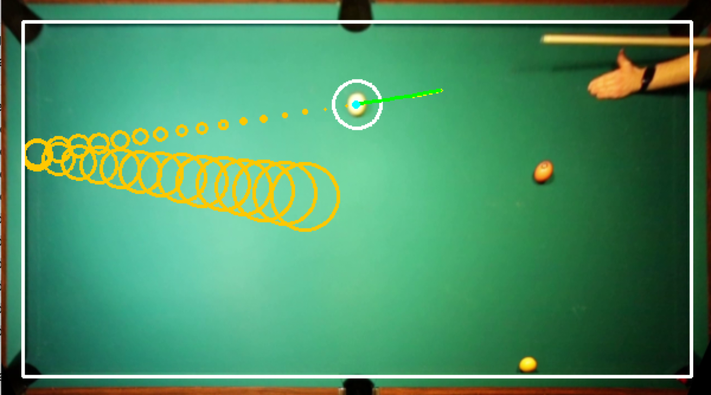

# Pool Prediction

This repository demonstrates the tracking and prediction of a pool ball's position with use of a modified Kalman filter.

## How to run?

### Real Video

`python main.js`

### Simulation

`python simulation.js`

## Navigation

### Filter implementation

The standard Kalman filter with constant velocity is found at [filter/filter_constant_velocity.py](https://github.com/marlon360/pool-prediction/blob/master/filter/filter_constant_velocity.py)

The extended Kalman filter with constant velocity and smart prediction is found at [filter/smart_cvm_filter.py](https://github.com/marlon360/pool-prediction/blob/master/filter/smart_cvm_filter.py)